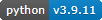
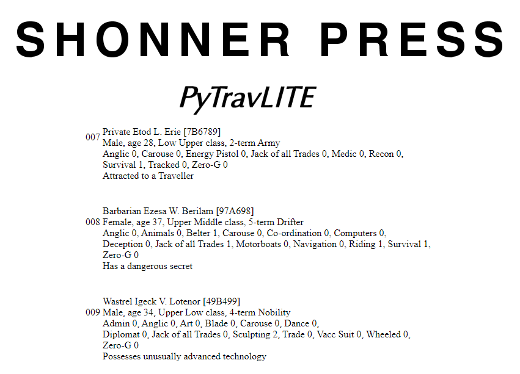
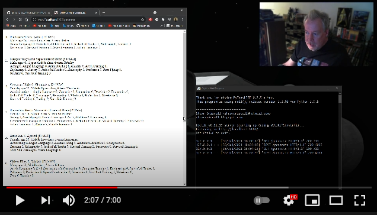
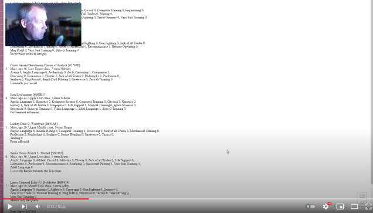

    

    
.. image:: https://readthedocs.org/projects/pytravliteguide/badge/?version=latest
    :target: http://pytravliteguide.readthedocs.io/en/latest/?badge=latest
    :alt: Doc Status
	
.. image:: https://img.shields.io/github/stars/ShawnDriscoll/PyTraveller-NPC-LITE.svg
    :target: https://github.com/ShawnDriscoll/PyTraveller-NPC-LITE/stargazers

**PyTravLITE 0.2.7: CharGen for Traveller**
===========================================

**PyTravLITE** is a Python 3.x program that generates NPCs for Mongoose Traveller 1st and 2nd Editions in a web browser.

Read the **PyTravLITE Guide** at http://pytravliteguide.readthedocs.io

Download the PDF from https://readthedocs.org/projects/pytravliteguide/downloads/pdf/latest

or the EPUB from https://readthedocs.org/projects/pytravliteguide/downloads/epub/latest

Requirements
------------

* **Windows 10**

   It might not work in OSX or Linux.
   
* **Python 3.9.11**
   
   **PyTravCalc** was written using the C implementation of Python
   version 3.9.11. Also known as CPython.

* **bottle 0.12.19**

   bottle testing has begun with the release of 0.1.0.
   
* **colorama 0.4.4**

   Because the dice roller may have some colored text messages for debugging.

Promo
-----

New in version 0.2.6
--------------------

.. |ss| raw:: html

    <strike>

.. |se| raw:: html

    </strike>

Things To-Do
------------

| Add faction types?
| Add equipment?
| Cheat codes.
|ss|

| Convert to Python 3.9.
| Instruction manual.
| Start on a To-Do.

|se|

**Known History**

* v0.2.7b

  Default dice roll choice is now 2D6 if left blank.

* v0.2.6b

  Quirks have been added for NPCs.

Warning
-------

**PyTravLITE** will not work with **Python 2.7-**.

Contact
-------
Questions? Please contact shawndriscoll@hotmail.com

The Traveller game in all forms is owned by Far Future Enterprises.
Copyright 1977 - 2022 Far Future Enterprises.
Traveller is a registered trademark of Far Future Enterprises.
