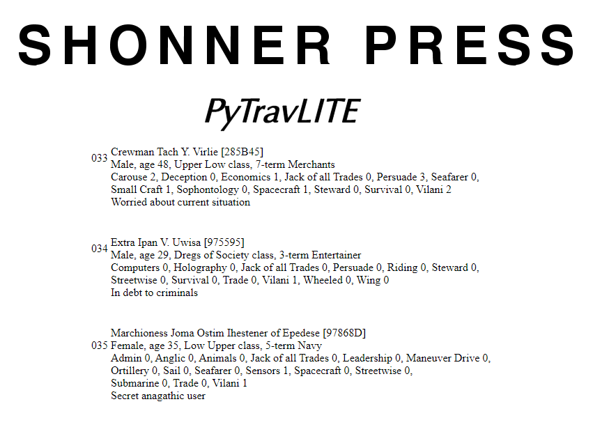

**PyTravLITE Guide**
====================

What began as a DOS prompt NPC generator escalated into a web-browsed one...

**PyTravLITE** is an easy-to-use open source NPC generator for Mongoose Traveller 1st and 2nd Editions. It's written
in Python 3.9.7 and includes **PyDiceroll 3.4** for its die rolling. Source for **PyDiceroll 3.4** can be found at
its `GitHub
<https://github.com/ShawnDriscoll/pydiceroll/>`__ repository.

**PyTravLITE** features minor logging and error tracking at this time.

This documentation explains how to install and use **PyTravLITE** for Traveller NPC generation.

.. image:: python_v3_9_7_tag.png
    :target: https://www.python.org/downloads/release/python-397/
    
.. image:: release_v0_2_6_tag.png

.. image:: https://readthedocs.org/projects/pytravliteguide/badge/?version=latest
    :target: http://pytravliteguide.readthedocs.io/en/latest/?badge=latest
    :alt: Doc Status
	
The Traveller game in all forms is owned by Far
Future Enterprises. Copyright 1977 - 2022 Far Future
Enterprises. Traveller is a registered trademark of Far
Future Enterprises.

.. toctree::
   :maxdepth: 2

   introduction
   installing
   whats_new
   tutorial
   saveddata
   license
   ffe
   about_the_author
